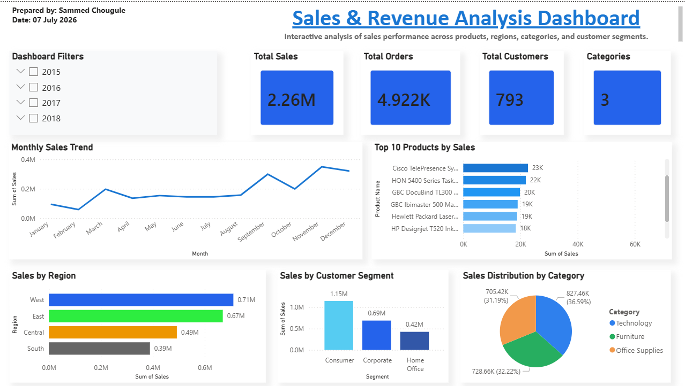

📊 Sales & Revenue Analysis Dashboard

An interactive **Sales & Revenue Analysis Dashboard** built using **Python (Pandas)** for data cleaning and **Power BI** for visualization. This project analyzes sales performance, revenue trends, customer segments, product categories, and regional sales to generate meaningful business insights.


📌 Project Overview

The objective of this project is to analyze sales data and create an interactive dashboard that helps businesses monitor key performance indicators (KPIs) and make data-driven decisions.

The project includes:
- Data Cleaning using Python (Pandas)
- Exploratory Data Analysis (EDA)
- Interactive Dashboard in Power BI
- Business Insights and Recommendations


🚀 Features

- 📈 Total Sales KPI
- 📦 Total Orders KPI
- 👥 Total Customers KPI
- 🗂️ Product Categories KPI
- 📅 Monthly Sales Trend
- 🌍 Sales by Region
- 🛒 Top 10 Products by Sales
- 👤 Sales by Customer Segment
- 🥧 Sales Distribution by Category
- 🎛️ Interactive Filters (Year, Region, Category, Segment, State)


🛠️ Tools & Technologies

- Python
- Pandas
- Jupyter Notebook
- Power BI
- Microsoft Excel
- Git
- GitHub


📂 Project Structure

```text
Sales-Revenue-Analysis-Dashboard
│
├── Data
│   ├── Super store data set.csv
│   └── Cleaned_Superstore.csv
│
├── Python
│   └── Cleaning.ipynb
│
├── PowerBI
│   └── Sales_Revenue_Analysis_Dashboard.pbix
│
├── Report
│   ├── Dashboard_Screenshot.png
│   └── Business_Insights.pdf
│
└── README.md
```


📊 Dashboard Preview

>"


📈 Key Performance Indicators (KPIs)

- **Total Sales:** $2.26 Million
- **Total Orders:** 4,922
- **Total Customers:** 793
- **Product Categories:** 3


💡 Business Insights

- The **West** region generated the highest sales.
- The **South** region recorded the lowest sales.
- **Technology** products contributed the highest revenue.
- The **Consumer** segment generated the largest share of sales.
- **Canon imageCLASS 2200 Advanced Copier** was the highest-selling product.
- Sales showed stronger performance during the final months of the year.
- Interactive filters allow users to explore sales by year, region, category, customer segment, and state.


🎯 Skills Demonstrated

- Data Cleaning
- Data Analysis
- Data Visualization
- Business Intelligence
- KPI Tracking
- Dashboard Design
- Power BI
- Python Programming
- Pandas


📚 Learning Outcomes

Through this project, I learned:

- Cleaning and preparing datasets using Pandas
- Performing exploratory data analysis (EDA)
- Designing interactive Power BI dashboards
- Creating business KPIs
- Generating actionable business insights
- Using Git and GitHub for version control


🔮 Future Improvements

- Add Profit Analysis
- Add Forecasting
- Customer Lifetime Value Analysis
- Profit Margin Dashboard
- Drill-through Reports
- Mobile Dashboard Layout


